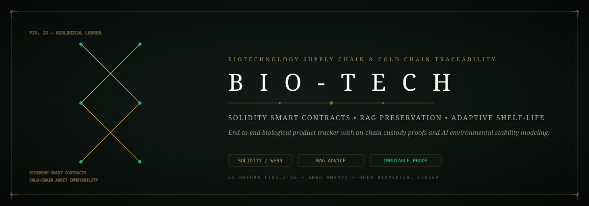
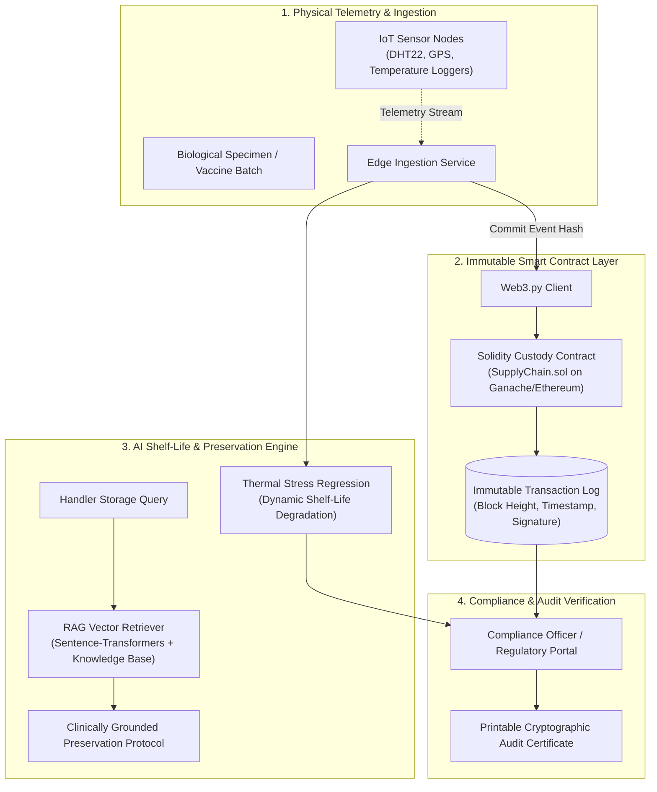
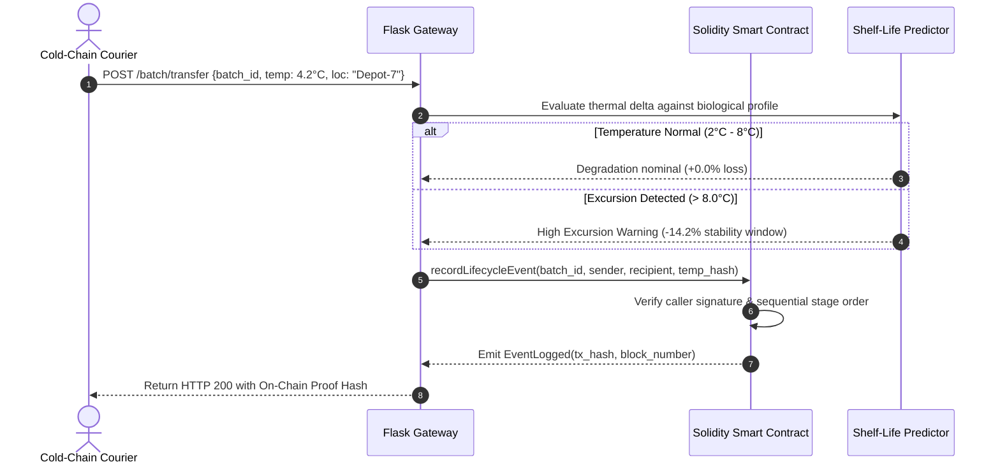

<div align="center">



# 🧬 Bio-Tech Supply Chain & Cold-Chain Traceability System
### *Blockchain-Backed Custody Ledgers, Adaptive ML Shelf-Life Modeling & RAG Preservation Intelligence*

[](https://github.com/Jaswanth1902/BIO-TECH)
[](https://github.com/Jaswanth1902/BIO-TECH)
[](https://github.com/Jaswanth1902/BIO-TECH)
[](https://github.com/Jaswanth1902/BIO-TECH)
[](LICENSE)

*An end-to-end biological product tracking platform with Ethereum-verified custody proofs, real-time temperature excursion alerts, and retrieval-augmented preservation guidance.*

</div>

---

## ⚡ The Architectural Vision

Counterfeit pharmaceuticals, broken cold chains, and unrecorded temperature excursions compromise sensitive biologics (vaccines, monoclonal antibodies, blood products) during transit. 

**BIO-TECH** solves cold-chain integrity through verifiable systems engineering:
- **Immutable On-Chain Custody**: Every lifecycle transition (Collection → Transport → Storage → Packaging → Dispensation) is committed to an Ethereum smart contract ledger, preventing retrospective falsification of transport logs.
- **Adaptive AI Shelf-Life Decay**: Real-time linear regression models dynamically recompute remaining shelf-life viability based on cumulative thermal stress ($T \times \Delta t$).
- **RAG-Driven Preservation Intelligence**: Drug-specific handling protocols (e.g. mRNA lipid nanoparticles vs lyophilized proteins) are retrieved via dense semantic search (`sentence-transformers`) to guide handlers in real-time.
- **Role-Based Access Control (RBAC)**: Distinct cryptographic identities for producers, couriers, clinical inspectors, and compliance auditors.

---

## 🏗️ Supply Chain Pipeline & Ledger Flow



---

## 🔄 Smart Contract Transaction Sequence



---

## 🧩 Antigravity Skills & Tooling Ecosystem

- **`clean-code`**: Separation of Web3 contract abstractions from Flask API routing and RAG pipelines.
- **`security-linting`**: Smart contract reentrancy defenses and secure environment key handling.
- **`diagram-design`**: Full architectural and lifecycle sequence visualization.
- **`systematic-debugging`**: Rigorous verification of edge temperatures and smart contract reversion states.

---

## 📦 Tech Stack & Dependencies

| Layer | Technology | Purpose |
| :--- | :--- | :--- |
| **Smart Contracts** | Solidity (`^0.8.0`), Web3.py | On-chain custody tracking, immutable transaction proofs |
| **Local Node** | Ganache / Ethereum Testnet | Deterministic local RPC testing and ledger verification |
| **API Server** | Flask, Flask-SQLAlchemy | REST API, batch state management, role authorization |
| **Machine Learning** | Scikit-Learn | Thermal stress decay calculations and remaining usable life |
| **Preservation RAG** | Sentence-Transformers | Vector embeddings over FDA/WHO biologics storage protocols |

---

## 🛡️ Security Hardening & Trust Architecture

1. **Role-Based Cryptographic Access**: Producer, Courier, and Staff roles are hard-enforced in both the Flask middleware and the Solidity contract function modifiers (`onlyProducer`, `onlyAuthorizedCourier`).
2. **Immutable Audit Trail**: Event logs emitted by the smart contract cannot be modified or deleted by any participant, including admins.
3. **Strict Temperature Thresholds**: Automated contract events flag batches as `COMPROMISED` if excursion duration exceeds regulatory ceilings.
4. **Secret Isolation**: Private keys and RPC endpoints are loaded via environment variables; zero mnemonic seeds committed to source.

---

## 🚀 Getting Started

### 1. Prerequisites
- Python 3.10+
- [Ganache](https://trufflesuite.com/ganache/) (for local Ethereum blockchain)

### 2. Installation
```bash
# Clone and enter directory
git clone https://github.com/Jaswanth1902/BIO-TECH.git
cd BIO-TECH

# Setup virtual environment
python -m venv venv
venv\Scripts\activate   # Windows
# source venv/bin/activate  # Linux/macOS

pip install -r requirements.txt
```

### 3. Initialize Knowledge Base & Models
```bash
python rag/build_kb.py
python ml/train_model.py
```

### 4. Deploy Smart Contract & Launch
```bash
# Ensure Ganache is running on 127.0.0.1:7545
python deploy_contract.py

# Start application server
python app.py
```
Access dashboard at `http://127.0.0.1:5000`.

---

## 📄 License & Maintainer

Distributed under the [MIT License](LICENSE). Maintained by [Jaswanth Reddy](https://github.com/Jaswanth1902) — *Passionate learner & creative problem solver learning from and giving back to the open-source community.*
